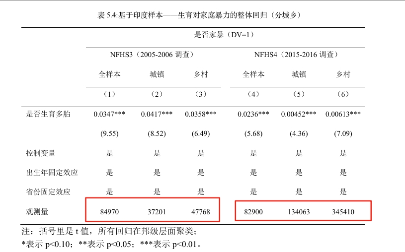
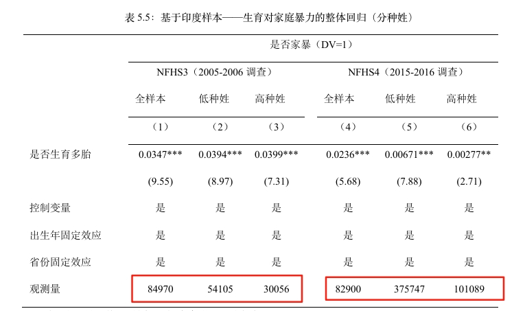
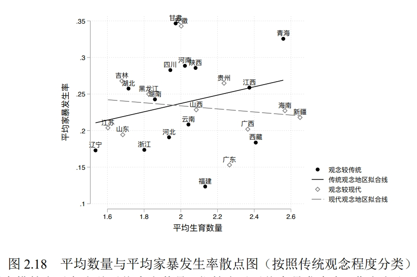
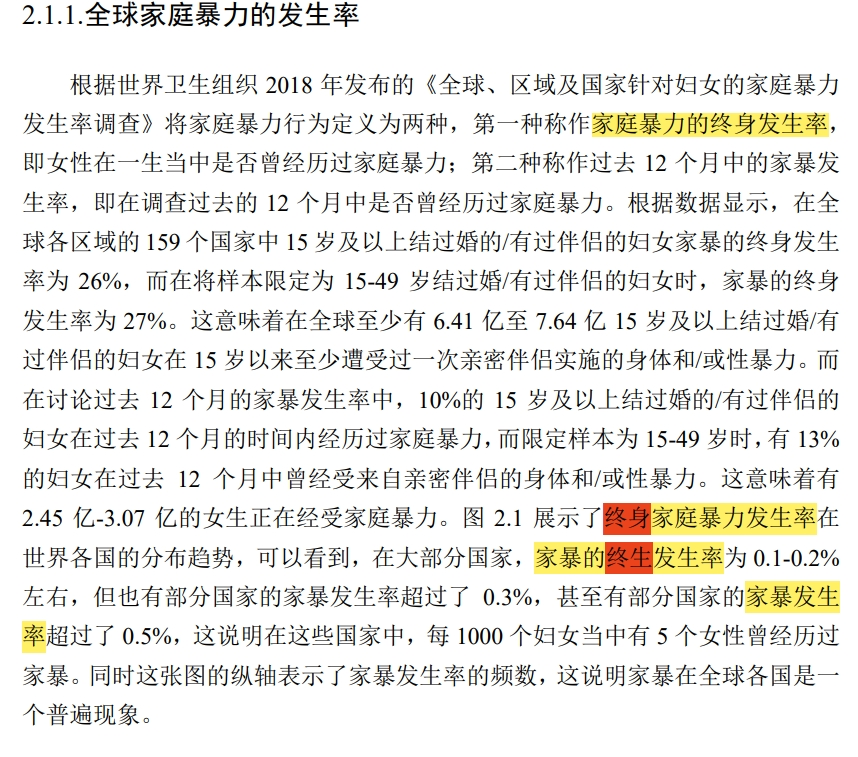
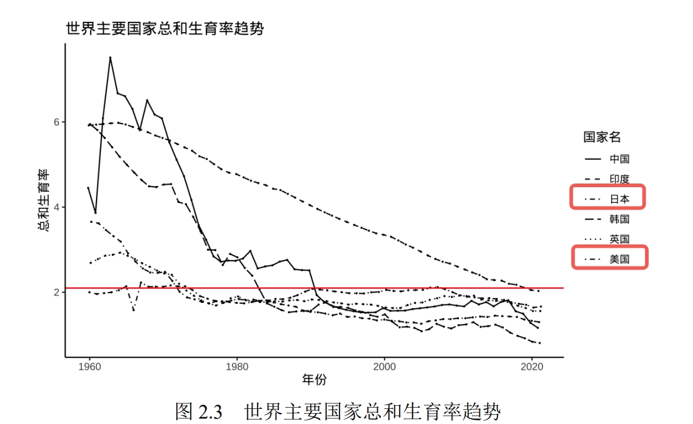
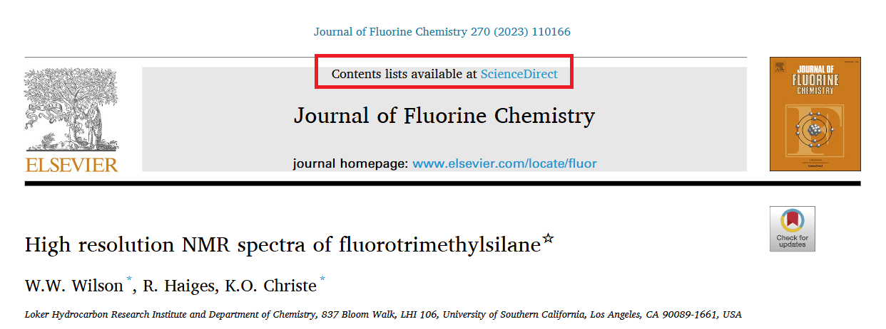

<h1 align="center">杨景媛论文问题汇总</h1>

&emsp;&emsp;本仓库专门用来记录武汉大学国际经济贸易专业杨景媛的**优秀**硕士毕业论文《中印生育行为影响家庭暴力的经济学分析》中存在的问题，本人认为该仓库似乎确实[1]是**全网最全**的错误记录。原论文在[这里](./paper/YJYpaper.pdf) 欢迎各位评论并列举更多的错误，也可以提供举报的地址。如下所示，这可是杨博自己声明的哦！    
 

---

该事件女主角提交给法院的相关视频、录音及图片证据[百度网盘](https://pan.baidu.com/s/1Jvw5mXjDltMEHARtg6c6Rg?pwd=i86x)

❗博主（李然于心）被粉衣哥带几个金哥深夜登门拜访了！！！视频在[夸克网盘](https://pan.quark.cn/s/10cebfa84661#/list/share)，顿时有点害怕捏！！！  

友情链接：[杨景媛事件相关](https://github.com/yangjingyuan0828/awesome-yangjingyuan)

## 📑TODO  
- [x] 收集论文中存在问题(不断更新中...)
- [x] 发布[举报地址合集](./doc/compilations.md) (不断更新中...)
- [x] 提供将本文档转为pdf的[教程](./doc/export2PDF.md) 🔥🔥🔥
- [x] [武汉大学经济与管理学院专业硕士学位论文写作指南（2024年第二版）](https://mpacc.whu.edu.cn/info/1028/3056.htm)
- [x] [2019年的武汉大学经管学院论文写作规范](https://mpacc.whu.edu.cn/info/1026/1193.htm)
- [x] 向中华人民共和国教育部举报[如图](./doc/jb1.jpeg)
- [x] 向[教育部学位与研究生教育发展中心](https://www.cdgdc.edu.cn/info/1024/2316.htm)举报
- [x] 向[武汉大学学术委员会](xsxf@whu.edu.cn)举报
- [x] 向[教育部学位与研究生教育发展中心](jdjb@cdgdc.edu.cn)举报
- [ ] 在教育部科研诚信管理信息系统举报
- [ ] 向湖北省教育厅举报
- [ ] 捅给路透社 彭博社 法新社等境外媒体和联合国教科文组织（UNESCO）
- [ ] 向爱思唯尔及所有大型SCI/SSCI出版机构的主编/副主编通报武汉大学所有涉嫌学术不端的证据，要求重点审查该校学术出版物
- [ ] ...

## 🏗️我们的诉求
- 要求武汉大学撤销杨某媛的硕士学位。  
- 要求武汉大学撤销对肖同学的处罚决定，并公开致歉。  
- 要求武汉大学保证肖同学顺利毕业，不能以身心健康问题或超过学习期限为由将肖同学退学。  
- 要求公布杨某媛的高考录取信息。
- 请党组织今后不要同意杨某媛的预备党员转正申请。

## 🔧论文主要问题
### 涉嫌造假  

1. 疑似内容编造(第一页倒数第三行内容)： 

>例如部分国家和地区出台的《立即逮捕法案》， 

并未找到因家暴出台的《立即逮捕法案》，此处疑似为 强制逮捕法案（mandatory arrest laws）。

2. 内容编造(第二页第五行内容)：  

>而在 2001 年随着《离婚法》的出台与宣传 

我国并未颁布《离婚法》，此为杜撰内容。

3. 数据编造(第十四页的图2.1)：  

>图2.1 全球各国家暴发生率直方图：
  

纵坐标为频数，频数指的是xxx出现的次数，只能是整数，可是论文图中却出现了小数，说明该数据为编造数据。 

且就算把每一条都按最大值5来计算，也只有60，根本凑不满100个国家，疑似数据编造。

4. 疑似数据编造(第四十三页的表5.1)：  

>  

城镇样本与乡村样本之和不等于全样本，疑似数据编造。  
例如：5230+5287=10517≠10519  
&emsp;&emsp;&emsp;5510+5354=10864≠10867   

注意该表格的标题为：
>表 5.1 基于中国样本——生育对家庭暴力的整体回归（分 1999/2000/2010 年数据）

可表格内容却是1990、2000、2010年，说明疑似标题手误将“1990”写成了“1999”

5. 疑似数据编造(第四十五页的表5.2)：  

>  

城镇样本与乡村样本之和不等于全样本，疑似数据编造。  

6. 疑似数据编造(第四十六页的表5.3)：  

>  

城镇样本与乡村样本之和不等于全样本，疑似数据编造。  

7. 疑似数据编造(第四十七页的表5.4)：  

>   

城镇样本与乡村样本之和不等于全样本，疑似数据编造。  

8. 疑似数据编造(第四十八页的表5.5)：  

>  

高种姓样本与低种姓样本之和不等于全样本，疑似数据编造。

### 涉嫌抄袭剽窃

1. 整段抄袭(第二页最后一段内容)：  

>在印度，根据印度国家犯罪研究局的官方报告，2019 年针对妇女的 40.5 万犯罪案件中，其中有超过 30%是家庭暴力案件。2021 年印度 NFHS-5 数据显示，在 18~49 岁的印度女性中，近三分之一的人遭受过家庭暴力，32%的已婚女性曾遭受伴侣在身体、性或情感等方面的暴力，其中 27%的女性在调查的近一年时间内至少遭受过一种形式的暴力。  

涉嫌抄袭论文 何晖,王凌林.印度反家庭暴力的实践与成效[J].现代世界警察, 2022(11):58-64 ，杨的原文内未出现任何引用。  

  

2. 整段抄袭(第三页第一段内容)：

>不完善的法律制度与复杂的举报流程是印度家庭暴力频发的外在原因。早在1983 年，印度刑法典修订的第 498A 条就规定如果丈夫或夫家亲属虐待妇女，处以最高三年的监禁及相应罚款。2005 年 6 月，印度通过首部《反家庭暴力法》。但印度反家庭暴力的法律并没有根据社会的变化进行修改。同时，复杂的举报证据与流程，加之缺乏严格执法，使印度反家庭暴力法律制度有名无实、形同虚设，很多案件不了了之。截至 2020 年底，基于第 498A 的定罪率不到 20%，印度法院总共有 65.1 万起 498A 家庭暴力案件悬而未决。

涉嫌抄袭论文 何晖,王凌林.印度反家庭暴力的实践与成效[J].现代世界警察, 2022(11):58-64 ，杨的原文内未出现任何引用。

  

3. 疑似抄袭未删干净(第四页最后一段的内容)：  

>2013 年 12 月，第十二届全国人大常委会通过了《关于调整完善生育政策的
决议》，其中规定，即单独二孩政策。不到两年后，为更进一步促进人口均衡发
展，修正逐渐失衡的人口结构，2015 年 10 月，中共十八届五中全会明确提出实
施全面二孩政策，从此，所有夫妇都获得了生育两个子女的权利。

“其中规定，即单独二孩政策。”与前后文不搭，疑似抄袭未删干净。  

### 数据错误

1. 数量错误(第三页倒数第六行内容)：

>全球两百多个国家中有 104 个国家的总和生育率低于代际人口平衡所需的 2.1 以下

全球总共有193个联合国会员国，4个联合国观察员国（梵蒂冈、巴勒斯坦、库克群岛、纽埃），并非两百多个国家，作者疑似将港澳台地区算作国家，这属于严重的**政治错误**，建议严查。

2. 年份错误(第四页第七行内容)：  

>新中国成立之后，由于社会经济的逐渐稳定与发展，全国总人口从 1049 年之前的 5.42 亿增长到 1970 年的 8.30 亿。

我国于1949年成立，并非1049年，这属于严重的**政治错误**。

3. 常识性错误(第十五页最后一段内容)：   

>预计到 2087 年，世界人口将达到峰值 103 亿人，之后将缓慢下降至 2100 年的 103 亿人。”   

这降了啥？其中必有一个数据是错误的。   

4. 横坐标异常(第二十页图 2.8、图2.9)：   
   
>  

疑似漏掉了T_1。 

5. 表格数据错误(第三十九页表4.1)：  

>  

表4.1的面板b和面板c中的最大值异常。  

6. 表格数据错误(第四十页表4.2)：  

>   

表4.2的中的最小值、最大值与区间不一致。   

7. 年份错误(第四十五页最后一段第四行内容)：   

>1990-201 年生育对家暴的影响不断减弱  

年份漏写一个数字。 

8. 横坐标异常(第五十五页图 6.7)： 
  
>  

疑似将事后8期写为事后7期。 

9. 捏造数据(第十三页1.1.2最后一段)：

>

印度并非只有22个邦和联邦属地，数据完全对不上。
相关链接：https://dhsprogram.com/pubs/pdf/fr339/fr339.pdf

>

10. 捏造数据(第四十一页表4.3)：

>

相关链接：https://dhsprogram.com/pubs/pdf/fr339/fr339.pdf
这数据完全对不上，总人数才61906。

>

### 数据分析错误

1. 常识性分析错误(第二十一页第一段倒数三行内容)：  

>  

如上图所示,0.01% 应为10000位女性中有一位。  

2. 数据分析异常(第二十四页的图2.15)：  

>  

对第二十四页论文中的图2.15（上图2.1）数据进行扒取，并对图片进行线性拟合（见上图2.2），得出图片线性拟合为y=0.1067xR2=01083，详细数据见[附件](./paper/testdata.csv)。  
经验证，该数据的r方仅有0.1，证明生育数量与家暴发生率几乎无关。  

3. 分析错误(第二十五页倒数第六行内容)：   

>本文用各地区人均道观数据衡量该地区思想传统程度

道教属于宗教范畴，不同地区的宗教分布不一致，故人均道观数跟当地思想传统程度无直接关系。

4. 强行拟合(第二十六页图2.18)：  

>   

图中的点散度过大，无明显线性关系。其中同为观念传统地区且生育率相近的甘肃和福建的家暴跨度过大，可说明该线不适合证明观念与家暴之间的关系。 

5. 公式分析错误(第三十三页第七行内容)：   

>增加量为1/2   

此处增加量应为ϕα/2。

6. 模型使用错误(第三十七页)： 

在论文第4 节 4.数据与实证策略 4.1.实证策略 4.1.1.基于双重固定效应模型的实证策略.

>  

该模型的被解释变量 DV, 代表个体是否遭遇家庭暴力; 由于被解释变量DV只有两种取值（二元变量），有或者没有遭遇家庭暴力, 因而这是一个典型的『二元选择模型（binary choice model）』  
计量经济学的基本常识: 不能用线性模型来解释一个二元选择变量. 应该使用 Logistic回归 或 Probit回归模型。  
但是, 论文中使用的所谓 "双重固定效应回归模型" 4.1 是一个线性模型. 这是一个严重的错误. 论文使用了错误的模型, 主要实证结果不可靠.  

7. 低级计算错误(第四十三页倒数第一行内容)：   

>城镇样本家暴发生率上升 3.2%，而乡村家暴发生率上升 5.4%，二者相差 2.1%。

5.4%-3.2%=2.2%，并非2.1%。  

8. 自相矛盾(第十页)：

>

前面说十分之一妇女，但是图里显示远低于0.1，而且是不分男女的。

9. 政策启示与结论对冲(第六十一页)：

7.1.结论第二段：

>首先，生育使得家庭暴力的发生率上升。在中国和印度，随着生育数量的增多，家暴发生率也不断上升。

7.2.政策启示第四点：

>第四，提供更多生育支持，建立生育友好社会。加大对生育的政策支持力度，为妇女提供更加全面的生育支持和保障

政策启示“加大生育支持以降低家暴”与结论中“生育导致家暴增加”疑似逻辑冲突。

### 重要数据未引用

文中多处重要数据未引用，找不到来源，怀疑该数据的真实性。

>  
 

### 写作与表达错误

1. 摘要翻译错误：  
>中文关键词：生育；家庭暴力；母职惩罚；社会规范

>英文关键词：Fertility；Domestic Violence；Outside Option；Social Norm  

“母职惩罚”和“Outside Option”的翻译无法对应。

2. 摘要翻译问题：  

> 

其中**关键词**三个字未翻译为英文Keywords。  

3. 英文摘要问题(英文摘要第十行)：

>Survey and the the National Family and Health Survey of India. 

同时出现两个"the"。

4. 概念混淆(第一页第二段第一至三行内容)：  

>世界卫生组织 2018 年发布的《全球、区域及国家针对妇女的家庭暴力发生率调查》中显示适龄女性的家庭暴力终身发生率仍然高达 27%，即有 27%的女性一生中至少遭受过一次来自丈夫或男性亲密伴侣的身体和/或性暴力侵害   

男性亲密伴侣没结婚的话不算家暴。  

5. 错别字(第三页图1.2的图注)：  

>注：图中横轴为时间线，纵轴为家暴发生率。1998-2021 年家暴发生率使用印度 NFHS2-5次调查计算得到。同时，图 1.2 标注了和印度家暴发生率相关的司法改革时间，此外，从2006 年开始印度民间反家暴组织“粉红邦”在印度北方地区开始活跃，也有效降低了家暴的发生率。

将“粉红帮”错写成了“粉红邦”。  

“NFHS2-5次调查” 疑似有语病或符号错误。

6. 错别字(第四页第一行内容)：

>伴随 90 年带股市房市大泡沫破裂  

此处应为“年代”而不是“年带”。   

7. 错别字(第五页第九至十行内容)：  

>这些诊所主要负责发放避孕相关药物即器材”  

将“及”错写为“即”。   

8. 错别字(第六页倒数第六至七行内容)：  

>而决定女性外部选则的关键因素包括女性的特质   

此处应为“选择”而不是“选则”。  

9. 错别字(第八页第六至七行内容)： 

>此时就只会有表达性大家暴  

此处的“大”疑似为“的”。   

10. 错误字符(第八页)：  

第八页 关于家庭暴力的其他文献 中的第六行内容：
>例如，g 通过越南的数据发现  

这个g指代不明，疑似错写字符。  

11. 漏字(第八页最后一行内容)：  

>并不一发生资源的转移

将“不一定”漏写为“不一”。  

12. 错别字(第九页倒数第二行内容)：  

>生育也会是的女性的工资率降低
   
将“使得”错写为“是的”；将“工资”错写为“工资率”。

13. 错别字(第十页最后一段内容)：  

>家庭经济学中围绕家庭暴力机制的讨论主要可以分为两只文献，第一支文献从家庭议价权出发，讨论了表达性家庭暴力背后的价格机制。第二支文献从工具性家暴行为的目的出发，解释了家暴行为可能具有的寻租属性。

将“支”错写为“只”。  

14. 错别字(第十三页2.1.1第一段内容)：  
  
>

同时出现“家庭暴力的终身发生率”、“终身家庭暴力发生率”、“家暴的终生发生率”和“家暴发生率”四种表达方式。

>疑似将“终身”和“终生”搞混。 

15. 错别字(第十三页倒数第六行内容)：  

>2.45 亿-3.07 亿的女生正在经受家庭暴力。   

疑似将“女性”错写为“女生”。

16. 写错时间(第十五页第一段第四行内容)：  

>与 1960 年 -1665 之间的剧烈增长形成明显对比  

疑似将“1965年”写为“1665”。 

17. 错别字(第十五页倒数第三行内容)：  

>未来非洲人口获奖贡献90%的世界人口增量

疑似把“或将”错写为“获奖”。  

18. 语病及错别字(第十六页倒数第七行内容)：  

>本人认为生育率与家暴发生率之间似乎确实存在某种正向关系   

疑似把“本文”错写为“本人”；“似乎确实”存在严重语病。  

19. 错别字(第十八页第三行内容)：  

>就业情况等多个纬度

把“维度”错写为“纬度”。 

20. 错别字(第十八页第二段第六行内容)： 

>生育确实给女性就业遭成了影响   

把“造”错写为“遭”。  

21. 错别字(第十八页第二段最后一行内容)：  
>和丈夫相对收入水平的不同以及生育情况都对家暴遭成了影响。  

把“造”错写为“遭”。  

22. 错别字(第十八页最后一段第三行内容)：  

>几乎可以忽略不及   

此处可能存在语病，且把“忽略不计”错写为“忽略不及”。  

23. 字符顺序错误(第二十二页倒数第六行内容)：  

>可以看到当女性收入远小于丈夫（即不到丈夫收入的 1/4 时），家暴发生率较高   

应该把“时”移到右括号右边。  

24. 错别字(第二十四页第一段第三行内容)：  

>这和本文之间预设的研究框架相符。   

疑似把“之前”错写为“之间”。   

25. 多余字(第二十四页第二段第一行内容)：  

>图 2.16 通展示了我国生育数量与平均家暴发生率之间的关系。   

其中的“通”为多余字。   

26. 标点符号错误(p25)：  

>第二十五页倒数第五行内容：“甘肃，福建西藏以及辽宁等地”   

甘肃、福建应该用顿号；福建西藏之间没加顿号。  

27. 用词不当(第二十六页倒数第六行内容)：  

>本文各省份分为宗族思想较强和宗族思想较弱的地区   

疑似把“图中”错写为“本文”。 

28. 图片标题错误(第二十六页)：  

图 2.19 下方的标题：
>“图2.19 平均数量与平均家暴发生率散点图（按照宗族文化程度分类）”   

将“平均生育数量”漏写为“平均数量”。  

29. 图注错误(第二十七页图2.19下面的标注)：  

图2.19下面的标注：
>注：图中横轴表示各省份平均生育数量，纵轴表示平均家暴发生率。本文使用了 Chen（2021）中对宗族文化的横梁变量，即各地区人均家谱数，并基于此变量分类。其中实点与实线表示宗族观念较强的地区，虚点与虚线表示宗族观念较弱的地区，结果发现，在宗族观念较弱的地区，生育数量与家暴发生率为正相关关系。

把“衡量”错写为“横梁”。  

30. 简称错误(第二十七页2.2.4节内容)：  

>也被称作受压迫的种姓（Scheduled Castes，简称 CS）   

简称错误，应为SCs或SC。  

31. 文字重复，缺标点符合(第三十五页最后一行至三十六页第一行的内容)：  

>从经济激励上，丈夫家暴的丈夫家暴的概率越高   

“丈夫家暴的”五个字重复，且最后忘记加句号。  

32. 多写符号(第四十页倒数第三行内容)：  

>包括丈夫是否曾经对你有过殴打等行为，。   

多写了一个逗号。    

33. 写错单词(第四十页倒数第二行内容)：  

>NHHS4 调查中关于受访者回答的描述性统计见表 4.3.从表中可以看到   

将“NFHS4”错写为“NHHS4”。  

34. 多处空格混乱：  

文中多处将“NHHS4”和“NHHS 4”以及将“NHHS3”和“NHHS 3”混着写，中间是否有空格未知。例如第四十页倒数第一段。

35. 错别字及错误字符(第四十一页的表格)：  

>  

疑似将“7.”写成了“x7.”

将“被迫”写成了“被破”。

36. 多写符号(第四十三页倒数第四行内容)：  

>3（生育 5 个以上）），家暴概率上升 4.4%。   

连续写了两个右括号。  

37. 不合适的主语(第四十五页第一行内容)：  

>本人仍采用个体是否 40 岁进行分组”   

疑似把“本文”错写为“本人”。  

38. 错别字(第四十五页倒数第五至六行内容)：  

>因此外部选择被恶化，更容易受到家暴，而当后代长大承认，  

疑似将“因为”写成了“因此”；将“长大成人”写成了“长大承认”。  

39. 文字重复(第四十八页倒数第二段第二至三行内容)：  

>无论是 NFHS3（2005-2006 年调查）还是 NFHS4（2015 与 2017 调查）调查  

“调查”二字重复。  

40. 符号错误(第四十八页倒数第二段最后一句内容)：  

>和中国相同的是，随着时间推移，生育对家暴的影响下降在城镇地区更为明显；  

段落最后以分号结尾。  

41. 文字重复(第四十九页第一段第五行内容)：  

>考虑在事件事件为 0（子女出生当年），  

“事件”二字重复。  

42. 错别字(第五十页倒数第二段第二行内容)：  

>诚征在生育后第一期就出现了明显的家暴上升，  

将“城镇”写成了“诚征”。  

43. 错别字(第五十六页中间段第三行内容)：  

>而在平均受教育水平的人均中  

将“人群”写成了“人均”。  

44. 多写符号(第五十六页倒数第三行内容)：  

>人口大邦（占全样本 95%以上）的母职惩罚）。   

母职惩罚后面多写了一个右括号。  

45. 错别字(第五十七页中间段第二行内容)：  

>从生育档期开始一直持续到生育后的第八年”  

疑似将“当期”写成了“档期”。 

46. 错别字(第五十九页第一段第三行内容)：  

>生育后家暴发生率会即可下降  

将“即刻”写成了“即可”。  

47. 错别字(第五十九页第二段第三行内容)：  

>受教育群体较高的人群  

将“受教育水平较高”写成了“受教育群体较高”。  

48. 错别字(第六十一页政策启示第三段最后一行内容)：  

>可以让受害者更方面的结束暴力关系  

将“方便”写成了“方面”。  

49. 错别字(第六十七页致谢部分第三段第四行内容)： 

>所以我希翼能构建一个生育友好型的社会”   

疑似将“希冀”写成了“希翼”。  

50. 标点符号错误(第六十七页致谢部分第四段第一行内容)：  

>我们时常听到现如今中国女性的地位难道还不够高吗？， 

问号和逗号连用。  

51. 文字错误(第六十八页致谢部分倒数第三段内容)：  

>本科毕业论文致谢的最后，我引了 Carl Sagan 所说的： 

这不是**硕士**毕业论文吗？怎么写的本科？不会连致谢都是抄的吧？  

52. 标点符号错误(第六十八页致谢部分倒数第二段内容)：  

>We make our world significant by the courage of our questions and by the depth of our answers。 

致谢中的英文以中文句号结尾。

53. 多处名字写错(第十七、二十、二十五、四十、四十二、五十一、五十五页)：  

1、多处将“Kleven”写成“Kelvin”，分别出现在第十七、四十、四十二页。  
2、多处将“Kleven”写成“Kelven”，分别出现在第二十、五十五页。  
3、将“Kleven”写成“Kelvev”，出现在第二十五页。
4、将“Kleven”写成“Kelevn”，出现在第五十一页。 

54. 多处图注内容错误(第五十六、五十七、五十八页)：  

1、图6.8注中将“NFHS 3”写成“NFHS3 年” 
2、图6.9注中将“NFHS 3”写成“NFHS3 年” 
3、图6.10注中将“NFHS 3”写成“NFHS3 年”  
4、图6.11注中将“NFHS 3”写成“NFHS3 年”  

### 格式与规范错误

1. 页码错误：  
>

论文的封面、声明、摘要、目录底下的页码的格式均存在问题。

另外，好像封面不需要页码吧？

2. 缩进问题：  

论文的英文摘要每一段开头未缩进。

3. 格式错误(第一页第二段第二至三行内容)：  

>即有 27%的女性一生中至少遭受过一次来自丈夫或男性亲密伴侣的身体和/或性暴力侵害  

没有必要使用“和/或”，直接使用或也能表达和的意思。 

4. 字体问题(第十五页第一段内容)： 

>&emsp;&emsp;工业化、城市化进程的推进使世界人口经历了从高出生率、高死亡率的低增长阶段，变更到高出生率、低死亡率的高增长阶段。当代世界人口出生率不断降低，人口增长情况正处在由高增长向低增长转变的过渡阶段。**根据图 2.2 所示。从上世纪 70 年代以来，世界范围内人口总和生育率开始明显下降，与 1960 年-1665 之间的剧烈增长形成明显对比。平均每个妇女在育龄期间会生育的子女数从 1970 年的 4.79 降至 2019 年的 2.40，降幅接近一半。截止 2021 年，世界平均总和生育率已接近代际人口平衡所需的 2.1。**  

未知意义的粗体文字。 

5. 图片标题格式错误(第十六页)：  

>  

其中日本和美国用了相同的线。  

6. 字体错误(第二十七页)：  

正文的数字和英文字母虽然文中大部分地方都正确使用Times New Roman字体，但是仍有不少正文的数字和英文并不是该字体，例如第二十七页：  

>  

7. 图片标题格式错误(第四十四页)：  

>图 5.1：生育子女数量对家庭暴力的影响 

其中图 5.1 后面加了冒号，与前后文格式不匹配。  

8. 引用格式错误(第五十三页最后一段第一行内容)：  

>本文基于 Chen（2021 年）构建的各地区宗族变量”  

该引用格式与前后文不一致。 

9. 个人疑惑

武大经管的毕业论文引用文献是按首字母排序的吗？不用交叉引用的吗？感觉非常奇怪。请武大官方给出确切的格式说明。 

### 学术伦理问题
该文章阐述家庭暴力与生育、传统文化、宗教、女性就业之间的关联，在数据拟合度低的情况下强行将家暴与文化、宗教捆绑，该课题可能涉及较为严重的**学术伦理问题**。  

### 文献引用错误

1. 图表引用错误(第二十六页倒数第七行内容)：  
>图 2.19 反映了这种现象，本文各省份分为宗族思想较强和宗族思想较弱的地区，结果发现，在宗族思想较强的地区，生育数量的上升往往伴随着较低的家暴发生率。  

图 2.19 反应的是家暴和生育的关系，跟宗教没有关系。  

2. 疑似引用重复(第六十三页)：  
 
>[43] Card D, Dahl G B. Family Violence and Football: The Effect of Unexpected Emotional Cues on Violent Behavior[J]. The Quarterly Journal of Economics, 2011, 126(1): 103-143.
[44] Card D, Dahl G B. Family Violence and Football: The Impact of Unexpected Emotional Cues on Violent Behavior[J]. Quarterly Journal of Economics 2011, 126(1): 103-143.  

其中[44]疑似错把“Effect”写为“Impact”。  

3. 疑似标题写错(第六十三页)：  

>[46] Cesur R, Sabia J J. When War Comes Home: The Impact of Combat Service on Domestic Violence[J]. Review of Economics and Statistics, 2016, 98(2): 209-225.  

我查到的题目只有 When War Comes Home: The effect of Combat Service on Domestic Violence

4. 完全重复(第六十四页)：  
  
>[59] Dugan L, Nagin D S, Rosenfeld R. Explaining the Decline in Intimate Partner Homicide: The Effects of Changing Domesticity, Women's Status, and Domestic Violence Resources[J]. Homicide Studies, 1999, 3(3): 187-214.  
[60] Dugan L, Nagin D S, Rosenfeld R. Explaining the Decline in Intimate Partner Homicide: The Effects of Changing Domesticity, Women's Status, and Domestic Violence Resources[J]. Homicide Studies, 1999, 3(3): 187-214.  

5. 引用未写完整(第六十五页)：  

>[72] Guo R. A Theory of Differential Fertility under Filial Piety[J].   

未写明会议/期刊的名称及出版年份。

在corssref、Google Scholar和Google都搜不到该论文，疑似为AI生成。 

6. 完全重复(第六十五页)：  

>[87] McElroy M B, Horney M J. Nash-Bargained Household Decisions: Toward a Generalization of the Theory of Demand[J]. International Economic Review, 1981, 22(2): 333.  
[88] McElroy M B, Horney M J. Nash-Bargained Household Decisions: Toward a Generalization of the Theory of Demand[J]. International Economic Review, 1981, 22(2): 333.  

7. 引用未写完整(第六十六页)：  

>[96] Ramos A. Household Decision Making with Violence: Implications for Conditional Cash Transfer Programs[J].   

未写明会议/期刊的名称及出版年份。  

8. 完全重复(第六十六页)：  
 
>[101]Tauchen H V, Witte A D, Long S K. Domestic Violence: A Nonrandom Affair[J]. International Economic Review, 1991, 32(2): 491.   
[102]Tauchen H, Witte A, Long S. Domestic Violence - a Nonrandom Affair[J]. International Economic Review, 1991, 32(2): 491-511.  

其中[102]中的符号“-”意义不明。  

9. 参考文献发表时间错误(第六十六页)：  

>[103]Terror as a Bargaining Instrument: A Case Study of Dowry Violence in Rural India[J]. The American Economic Review, 2024. 

疑似为了满足引用较新论文的要求，串改文献发表时间。原时间为：

>Bloch F, Rao V. Terror as a bargaining instrument: A case study of dowry violence in rural India[J]. American Economic Review, 2002, 92(4): 1029-1043.
文献url：https://www.aeaweb.org/articles?id=10.1257/00028280260344588

10. 疑似引用化学论文(第六十六页)：  
>[105]Wilson W W, Haiges R, Christe K. Contents Lists Available at Sciencedirect[J]. 2023.  

该引用中“Contents Lists Available at Sciencedirect”，意思为“可在Sciencedirect获取”，不是某个文章的题目，该文章的出处疑似为化学材料相关期刊，详情如下图：

>

11. 论文正文中很难找到引用了参考文献中的一些文献。 

例如第九至十页1.2.2小节引用的论文，我在参考文献中大部分都找不到。

12. 参考文献内容疑似未在正文引用  
参考文献[90], [91], [96], [97], [99], [68] 未在正文中找到

13. 参考文献格式不符合武汉大学经管学院硕士学位论文规范  
参考文献[100]到[107]，序号与姓名间（]之后）无空格  

## 🏋️‍♂️本人声明
&emsp;&emsp;在预备党员考察期内，杨景媛同志在思想上尖酸刻薄，刻意制造性别对立；在法律上知法犯法，涉嫌恶意诬告他人，无端创造《离婚法》；在学业上敷衍了事，毕业论文问题严重，给学校名誉造成了不可估量的伤害。本人实名反对其党员转正，请党组织今后不要同意杨景媛的预备党员转正申请。

## 📖参考文献
[1]杨景媛. 中印生育行为影响家庭暴力的经济学分析. 武汉大学, 2024

## 🙏acknowledge
- 感谢各位提的issue
- 感谢知乎答主 云杉
- 感谢知乎答主 同工Same
- 感谢哔哩哔哩up主 [水论文的程序猿](https://b23.tv/wmJtrZa)
